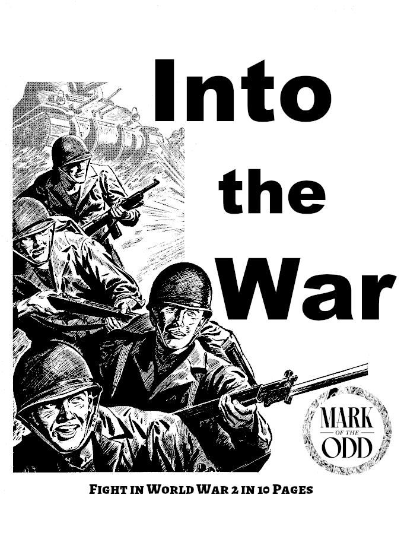

```{=latex}
\begin{center}
```
{ height=100% } 

```{=latex}
\end{center}
```

Chris McDowall is the original creator of Into the Odd. For more on Into the Odd, see www.bastionland.com.
\newpage{}

# Introduction
- This is a World War 2 table top RPG using the Into the Odd mechanics
- You are in the war, you are the good guys. The Fascists are the bad guys.
- You play a single member of an elite squad, gameplay is mission based.
- Ideally missions can be completed in a single session of gaming.

# Characters
To create a character follow these steps:

1. Roll ability scores
2. Select languages
3. Roll HP
4. Pick two attribues
5. Give yourself a name and physical description.
6. Acquire equipment 

# Ability Scores
Roll 3d6 for each of the following ability scores, also called stats.

- Strength (STR) - Fighting, fortitude, and toughness
- Dexterity (DEX) - Stealth, athlethics, and reflexes
- Willpower (WIL) - Confidence, discipline, and charisma

# Languages
- You are fluent in your native language.
- Roll 1d4, gain that many additional languages. You are proficient in these.

# Hitpoints & Health
- Roll 1d6, add 4, this is your HP, between 5 and 10.
- Damage is first dealt to your HP, this can be recovered with a short rest.
- When your HP is at zero, any additional damage is dealt to your strength.
- Damage to strength can be recovered with a week of rest.
- If your strength reaches zero, you die.

\newpage{}

# Attributes 
Pick two

- **Charisma**, charms personel on a 4 in 6, they'll follow simple suggestions.
- **Discrete**, can palm anything, can easily sneak small items undetected.
- **Electronics**, can use any electronic gear, including enemy radios.
- **Hauler**, can carry up to 15 slots of items without being slowed.
- **Healing**, can use Medic's Kit to restore one player's STR score per use.
- **Lethal**, add +1 damage to all successful attacks.
- **Lucky**, can reroll 2 dice rolls per day.
- **Nightsight**, clearer and better vision at night. 
- **Organzation**, three times per day, self or ally may reroll *failed saves*.
- **Pilot**, can fly any type of airplane.
- **Repair**, can fix or rig mechanical equipment and electronics.
- **Saboteur**, can set any physical object to fail on its next use.
- **Tough**, always have a DR of 2.
- **Trained**, can use any weaponry.
- **Tactics**, +1 to initiative rolls, nearby allies gain +2 to damage rolls.

# Carry Capacity & Movement
- Players can carry up to 10 slots of items and still move normally.
- Each player has a maximum of 20 slots, one slot is about 10 pounds of gear.
- **Slowed**: Half movement when carrying more than 10 slots (15 with **hauler**). 
- Some smaller items can be stacked into 1 slot, but they must be alike.
- If you do not have weapon in hand, you may fireman carry 1 person while carrying your normal slot limit (10 or 15); you are **slowed**.

\newpage{}

# Equipment
- Everyone starts with a **rucksack** that can hold up to 20 slots of items.
- You do not have to pay for equipment; unlisted items take 1 week to arrive.
- If an item says **per** it is stackable; e.g. 2 per means 2 items stack per 1 slot.
- You cannot mix stackable items, slots are limited to **item type**.
- **Pistols** and **revolvers**, if holstered on a hip, do not take a slot.
- **Mines** disable all vehicles, and deal 4d8 damage to non-tracked ones.
- **Medic's Kits** can only be used by Medics, they have 6 uses per mission.
- **First Aid kits** can be used by anyone, one usage, heals 2 STR for 1 person.
- **Handheld radios** work within 1 mile ranges; **backpack radios**, 3 miles.
- **Detonators** can be a timer (up to 30 min.) or wire detonator (300 ft).
- **Grenade launchers** are used with **rifle grenades** and attach to rifles.
- You must **specify** grenade types: hand or rifle, normal or smoke.

| Weapons            | Slots | Gear                   | Slots 
|--------------------|-------|------------------------|-------
| Automatic Rifle    | 3     | Ammo, 6 reloads        | 1 
| Bazooka            | 3     | Ammo MG, 2 reloads     | 1
| Carbine            | 2     | Bed Roll               | 1
| Cyanide Pills 6ct. | 3 Per | Binoculars             | 1     
| Detonator & wire   | 1     | Crowbar                | 1
| Explosives         | 2 per | First Aid Kit, 1 use   | 1
| Gasmask            | 1     | Flares                 | 3 per
| Grenade Launcher   | 1     | Flashlight             | 2 per
| Grenades, any      | 3 per | Lockpicks              | 1  
| Knife or Bayonet   | 0     | Medic's Kit            | 3
| Machine gun        | 3     | Mess Kit & Canteen     | 1     
| Mines              | 2 Per | Radio, Backpack, 3 mi. | 3
| Pistol, any        | 1     | Radio, Handheld, 1 mi. | 1 
| Poison, 1 use      | 3 per | Rations, 1 week        | 1     
| Revolver           | 1     | Rope, 50ft per slot    | 1
| Rifle              | 2     | Rucksack               | 0     
| Shotgun            | 2     | Tent, 2 person         | 1     
| Sniper Rifle       | 2     | Trench tool            | 1
| Sub Machine gun    | 2     | Winter Gear            | 1  

\newpage{}
# Weapons
- **Blast damage** effects all targets in a 20 foot radius, roll damage for each.
- **DR**, damage reduction, reduces the total damage received.
- **AP**, armor piercing, attacks ignore half of the target's DR, rounded up.
- **AP** weapons permanently reduce a target's DR by 2 on succesful hits.
- **Smoke grenades** provide cover in a 20 foot radius, until they dissipate. 
- **Bayonets** can be equipped to Rifles, Shotguns, or Automatic rifles.
- **Machine guns** must be fired prone or while mounted on a surface.

|  Weapons             | Damage  | Notes            |
|----------------------|---------|------------------|
|  Knife or Bayonet    | 1d4 + 4 |                  |
|  Pistol, Silenced .22| 1d4 + 1 |                  |
|  Pistol              | 1d6     |                  |
|  Revolver            | 1d6 + 1 |                  |
|  Sub Machine gun     | 2d6     |                  |
|  Carbine             | 2d6 + 1 |                  |
|  Rifle               | 2d6 + 2 |                  |
|  Automatic Rifle     | 3d6     |                  |
|  Shotgun             | 4d6     |                  |
|  Sniper Rifle        | 6d4     | Has a scope |
|  Machine gun         | 4d6     | Prone or mounted only |
|  Bazooka             | 5d8     | Blast Damage, AP |
|  Grenade, rifle      | 2d8     | Blast Damage, AP |
|  Grenade, hand       | 2d8     | Blast Damage, AP |
|  Grenade, smoke      | 0       | Lasts 2d4 rounds |

\newpage{}

# Playing the Game
- **Saves**: A Save is a 1d20 roll to avoid danger from a risky action or situation. 
- Save successes are always on under or equal to an appropriate Ability Score.
- For all saves, 1 is always a success and 20 always a failure.

## Turns
- Generally the Players take their turn before any enemies.
- If there is a risk of being surprised, characters must each roll a DEX Save or be unable to act on the first turn.
- On their turn, Players can act in any order they wish.

## Actions
- On your turn a character can move and perform an action. An action can be anything from negotiating, to attacking, to fleeing. 
- Going prone or getting up from prone is equivalent to a movement.
- For other actions the Referee calls for the character at risk to roll a Save. 
- For example, an attempt to trip an opponent might force them to pass a STR Save to stay on their feet, while an attempt to trick an opponent into surrender may force them to pass a WIL Save or lower their arms. 

## Attacks
- An attacker rolls a die dictated by their weapon, and subtracts the opponent's Armour score. Their attack causes this much Damage.
- Range weapons cannot be used in melee, but can be used as improvised clubs with 1d4 damage.
- Attacks that are Impaired, such as firing through cover, or fighting while grappled, roll 1d4 Damage regardless of weapon. 
- Similarly, attacks that are Enhanced by a risky stunt or a helpless or vulnerable target, roll double damage dice.

## Morale
- Groups require a WIL Save to avoid being routed when they lose half of their total numbers.
- Groups with a leader may use the leader's WIL score in place of their own.
- Lone combatants must pass this Save when they are reduced to 0hp, this applies to opponents and allies but not Player characters.
- Fleeing to safety under pursuit requires a DEX Save and somewhere to withdraw to. 

## Damage to Players
- **Damage**: When an individual takes Damage they lose that many hp. If they have no hp left, they are wounded, and any remaining Damage is removed from their STR score. They must then pass a STR Save to avoid Critical Damage. 
- **Critical Damage**: A character that takes Critical Damage is unable to take further action until they are tended to by an ally and have a Short Rest. If they are left for an hour without being tended to, they die. 
- **Ability Score Loss**: If a character has their STR score reduced to zero they are dead. If their DEX or WIL are reduced to zero the character is paralysed or mentally broken respectively, and cannot act until they have a Full Rest. 
- **Death**: When a character dies the Player creates a new character and the Referee finds a way to have them join the group as soon as possible. Here, quickness is required over realism. Alternatively the Player may control a Hireling or Member of their Company.
- **Poison** usually causes Ability Score loss. 
- Effects like Blindness will Impair attacks and call for Saves to carry out usually simple actions. 

## Healing & Resting
- Outside of combat, players may rest to heal.
- **Short Rest**: Spend 30 minutes resting, gain 1d6 HP. 
- **Full Rest**: 1 week of downtime, restores all HP and ability scores.
- **Deprived**: Somebody deprived of a crucial need (e.g. food, water, or warmth) cannot benefit from Rests.
- First aid kits can heal 2 STR, medic's kits can heal all STR.

\newpage{}
## Communcations
- Players are skilled in hand signal communication, ideal for combat or stealth. 
- Hand signals are only dimished by visibility.
- Vocal and radio comms are easily obfuscated by gunfire and explosions. 
- Radios cannot be used while handling a weapon.
- Handheld radios have a working radius of 1 mile, backpacks radios 3 miles.

## Light and Vision
- Scopes and Binoculars easily let someone see **twice** as far as normal.
- At night, you can see **half** as far as normal.
- At night, Scopes and Binoculars easily let someone see a normal distance.
- Someone creating a light at night (e.g. lighting a cigarette) is an easy target.

## Luck Rolls
- Sometimes you’ll want an element of randomness without rolling a Save, particularly in situations dictated by luck or those that fall outside of the three Ability Scores. 
- For these type of situations roll a d6. A high roll favours the Players, and a low roll means bad luck for the Players. 
- The Referee decides what a specific result means for the situation at hand. 

\newpage{}
# Enemies & NPCs
- The following table applies to all NPCs, whether ally or enemy.
- All enemies and NPCs have 10s for their stat block; STR, DEX, WIL.
- Damage dealt to enemies reduces HP, death occurs at 0 HP for them.
- Tanks, amored cars, and some Jeeps have machine guns, a **MG**.
- Tanks get 2 attacks per turn, 1 main gun and one **MG**.

| Enemy             | HP | Damage per Attack |
|-------------------|----|-------------------|
| Solider           | 7  | 1d8 + 1           |
| Sergeant          | 9  | 1d8 + 2           |
| Sniper            | 8  | 2d8               |
| Machine Gunner    | 10 | 3d8               |
| Jeep, with MG     | 12 | 3d8               |
| Armored Car       | 18 | 3d8               |
| Armored Carrier   | 18 | 3d8               |
| Small Tank        | 30 | 5d8, 3d8          |
| Medium Tank       | 45 | 7d8, 3d8          |
| Heavy Tank        | 60 | 8d8, 3d8          |

# Area Effect Attacks
Some attacks, from artillery, planes, or mortars, may harm player characters, the following rules attempt to account for those events. All of these attacks require a DEX save for half damage.

| Attack Type            | Damage |
|------------------------|--------|
| Artillery              | 6d8    |
| Mortar fire            | 4d8    |
| Dive Bombers           | 4d8    |
| Airplane Strafing Runs | 3d8 +1 |
| Naval Bombardment      | 8d8    |

\newpage{}
# Optional Rules
- **Language Proficiencies**: For each secondary language, roll 1d6: 1-2 spoken only, 3-4 spoken & written, 5-6 fluent.
- **Attack Rolls**: Roll 1d6 to attack, miss on 1s and 2s.
- **Distance**: If you are very far from your target, take -1 on attacks, if using attack rolls.
- **Pin Down**: 3 attacks on a 10 foot area forces the occupying opponents to lose their next attack.

