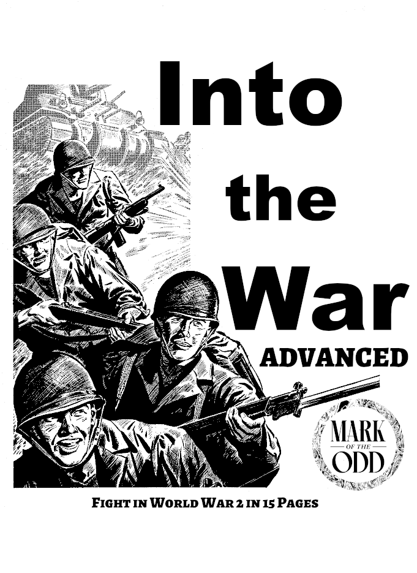

```{=latex}
\begin{center}
```
{ height=100% } 

```{=latex}
\end{center}
```

Chris McDowall is the original creator of Into the Odd. For more on Into the Odd, see www.bastionland.com.
\newpage{}

# Introduction
- This is a World War 2 table top RPG using the Into the Odd mechanics
- Players comprise a squad of elite troops from a variety of services.
- You are in the war, you are the good guys. The Fascists are the bad guys.

# Characters
To create a character follow these steps:

1. Roll ability scores
2. Roll HP
3. Pick a class
4. Give yourself a name and physical description.
5. Acquire equipment 

# Ability Scores
Roll 3d6 for each of the following ability scores, also called stats.

- Strength (STR) - Fighting, fortitude, and toughness
- Dexterity (DEX) - Stealth, athlethics, and reflexes
- Willpower (WIL) - Confidence, discipline, and charisma

# Hitpoints & Health
- Roll 1d6, add 4, this is your HP, between 5 and 10.
- Damage is first dealt to your HP, this can be recovered with a short rest.
- When your HP is at zero, any additional damage is dealt to your strength.
- Damage to strength can be recovered with a week of rest.
- If your strength reaches zero, you die.
- Hit points can only increase with high rolls on the Scars Table.

\newpage{}

# Classes
Pick a class. Each class has a set of bonuses or abilities.

## Soldier
- **Tough**, always have a DR of 2.
- **Trained**, can use any weaponry.

## Marine
- **Sharpshooter**, when using any rifle, only miss on attack rolls of 1
- **Lethal**, add +1 damage to all successful attacks.

## Paratrooper
- **Nightsight**, +50 feet of vision at night. 
- **Hauler**, can carry 15 slots of items without being slowed.

## Engineer 
- **Electronics**, can use any electronic gear, including enemy radios.
- **Repair**, can repair common mechanical equipment and electronics.

## Medic
- **Healing**, can use Medic's Kit to restore one player's STR score per use.
- **Lucky**, can reroll attack rolls twice per day.

## Spy
- **Charisma**, charms personel on a 4 in 6, they'll follow simple suggestions.
- **Discrete**, can palm anything, can sneak small items past guards.

## Officer
- **Tactics**, allies within 150 feet gain +2 damage on successful attacks.
- **Organzation**, three times per day, self or ally may reroll failed saves.

## Pilot
- **Air Pilot**, Can fly any type of airplane.
- **Repair**, can repair common mechanical equipment and any airplane.

\newpage{}

# Skills & Training
To be skilled in something means you can perform it in combat. All characters have training in the following:

- Rifles, pistols, grenades
- Hand signals for tactical communciation
- Parachute Drops & Map usage
- Motor vehicles and motorcycles, but not tanks or tracked ones.
- Radio operation, but not enemy radios.

With higher ranks, characters may learn to use the following:

- Machine guns
- Bazookas
- Tank driving / Tracked vehicle driving
- Tank gunnery
- Airplane piloting
- Air navigation
- Small boat piloting
- Sea Navigation
- Electronics operation, can use all radios
- Artillery operation (requires 2 people to perform)

Other skills may be created by consulting with the Referee.

# Carry Capacity & Movement
- Players can carry up to 10 slots of items and still move normally.
- Each player has a maximum of 20 slots, one slot is about 10 pounds of gear.
- **Slowed**: Half movement speeds when carrying more than 10 items (15 for paratroopers). 
- Some smaller items can be stacked into 1 slot, but they must be alike.
- If you do not have weapon in hand, you may fireman carry 1 person while carry your normal slot limit (10 or 15); you are **slowed**.
- Combat movement, in 1 round (10 seconds)
    - 50 feet with an action, such as firing or reloading.
    - 100 feet without acting, this is a double movement.
- Overland movement, in 1 turn (10 minutes):
    - **Walking**: 1500 feet or 500 yards, when carrying any equipment.
    - **Running**: 3000 feet or 1000 yards, when carrying any equipment
    - **Sprinting**: 6000 feet or 2000 yards, but carrying *no equipment*.

\newpage{}

# Equipment
- Everyone starts with a rucksack and it can hold 10 items, 15 for paratroopers.
- You do not have to pay for equipment; unlisted items take 1 week to arrive.
- If an item says "per" it is stackable; 2 per means you can stack 2 per 1 slot.
- You cannot mix stackable items, slots are limited to item type.
- Pistols and revolvers, if holstered on a hip, do not take a slot.
- Mines disable all vehicles, and deals 4d8 damage to non tracked ones.
- Medic's Kits can only be used by Medics, they have 6 uses per mission.
- First Aid kits can be used by anyone, one usage, heals 2 STR for 1 person.
- Handheld radios work within 1 mile ranges; backpack ones within 3 miles.
- Detonators can be a timer (up to 30 min.) or wire detonator (up to 300 ft).
- Grenade launcher can be attached to Rifles only, used with **rifle grenades**.

| Weapons            | Slots | Gear                   | Slots 
|--------------------|-------|------------------------|-------
| Knife or Bayonet   | 0     | Rucksack               | 0     
| Pistol             | 1     | Flashlight             | 2 per
| Revolver           | 1     | Tent, 2 person         | 1     
| Sub Machine gun    | 2     | Bed Roll               | 1
| Carbine            | 1     | Winter Gear            | 1     
| Rifle              | 1     | Binoculars             | 1     
| Automatic Rifle    | 2     | Rations, 1 week        | 1     
| Shotgun            | 3     | Mess Kit & Canteen     | 1     
| Sniper Rifle       | 3     | Flares                 | 3 per
| Machine gun        | 3     | Radio, Handheld, 1 mi. | 1 
| Bazooka            | 3     | Radio, Backpack, 3 mi. | 3
| Grenades, any      | 3 per | Crowbar                | 1
| Grenade Launcher   | 1     |     ...                | 0 
| Explosives         | 2 per | Rope, 50ft per slot    | 1
| Detonator & wire   | 1     | Ammo, 6 reloads        | 1 
| Mines              | 2 Per | MG Ammo, 2 reloads     | 1 
| Cyanide Pills 6ct. | 3 Per | Medic's Kit            | 3
| Poison, 1 use      | 3 per | First Aid Kit, 1 use   | 1
| Gasmask            | 1     | Lockpicks              | 1  

\newpage{}
# Weapons
- Only soliders and marines can use machine guns.
- Only soliders can use bazookas
- **Blast damage** effects all targets in a 20 foot radius, roll damage for each.
- **DR**, damage reduction, reduces the total damage received.
- **AP**, armor piercing, attacks ignore half of the target's DR, rounded up.
- **AP** weapons permanently reduce a target's DR by 2 on succesful hits.
- **Smoke grenades** provide cover in a 20 foot radius, until they dissipate. 
- **Knives** can be freely unsheeted if you drop your current weapon.
- **Bayonets** can be equipped to Rifles, Shotguns, or Automatic rifles.
- All weapons can be used as **improvised melee** weapons, for 1d4 damage.
- Ranged weapons have limited attacks before they must be reloaded.

|  Weapons             | Damage  | Range   | Notes            |
|----------------------|---------|---------|------------------|
|  Knife or Bayonet    | 1d4 + 4 | Close   |                  |
|  Pistol              | 1d6     | Near    | 8 attacks        |
|  Revolver            | 1d6 + 1 | Near    | 6 attacks        |
|  Sub Machine gun     | 2d6     | Near    | 20 attacks       |
|  Carbine             | 2d6 + 1 | Far     | 15 attacks       |
|  Rifle               | 2d6 + 2 | Far     | 10 attacks       |
|  Automatic Rifle     | 3d6     | Far     | 15 attacks       |
|  Shotgun             | 4d6     | Near    | 8 attacks        |
|  Sniper Rifle        | 6d4     | Extreme | 5 attacks        |
|  Machine gun         | 4d6     | Far     | 50 attacks       |
|  Bazooka             | 5d8     | Far     | Blast Damage, AP |
|  Grenade, explosive  | 2d8     | Near    | Blast Damage, AP |
|  Grenade, rifle      | 2d8     | Far     | Blast Damage, AP |
|  Grenade, smoke      | 0       | Near    | Lasts 2d4 rounds |

# Distance and Weapon Ranges
- There are 5 bands of ranges normally used in combat.
- Melee weapons can only be used in close range, unless thrown.
- You may use weapons outside thier normal ranges.
- For attacks outside your weapon's range, take -1 per higher distance band.
- **Close**: Roughly within 5 feet.
- **Near**: Between 5 and 100 feet.
- **Far**: Between 101 and 300 feet.
- **Distant**: Between 301 and 1500 feet.
- **Extreme**: Between 1501 and 3000 feet.


\newpage{}

# Playing the Game
- **Saves**: A Save is a 1d20 roll to avoid danger from a risky action or situation. 
- Save successes are always on under or equal to an appropriate Ability Score.
- For all saves, 1 is always a success and 20 always a failure.

## Missions
- Gameplay is not necessarily frontline combat; rather bespoke missions.
- Scenarios are normally mission driven, with a clear objective.
- Mission objectives are intended to aid the allies on the war fronts.

## Turns
- Generally the Players take their turn before any enemies.
- If there is a risk of being surprised, characters must each roll a DEX Save or be unable to act on the first turn.
- On their turn, Players can act in any order they wish.
- In combat, turns are 10 seconds, sometimes called rounds.
- Outside of combat, if you need to track turns, they are 10 minutes of time.

## Actions
- On your turn a character can move and perform an action. An action can be anything from negotiating, to attacking, to fleeing. 
- Depending on the action, you may need a relevant skill, per Referee decision.
- Attacks are detailed below in the **Combat** section.
- For other actions the Referee calls for the character at risk to roll a Save. 
- For example, an attempt to trip an opponent might force them to pass a STR Save to stay on their feet, while an attempt to trick an opponent into surrender may force them to pass a WIL Save or lower their arms. 

## Ranks
- Whenever you successfully perform 2 missions you rank up.
- Whenever you rank you can gain 1 more skill.
- Gained skills require 1 month of time in training.
- Optionally, if you performed a similar activity to the skill while on a mission, you can train in 2 weeks instead.

\newpage{}
# Combat
1. **Surprise**: If one side catches the other offguard, they may gain 1 free round of actions before combat begins.
2. **Initiative**: Players Roll 1d6, on 1-3 referee acts first, 4-6 players act first.
    - Combat is side versus side; check for initiative winner performs all actions, then the loser acts.
3. **Morale**: For NPCs, required if they lose half their numbers.
4. **Combat Turns**: may move and act (such as attack or reload), double move, or double attack.
    - You have two acts you can perform on your turn; these can be a combination of movement, attacks, reloads.
    - You may perform certain actions twice on your turn: double move or double attack. Bazookas cannot double attack, but you can attack and reload.
    - Instead of moving, you may either become prone or get up from prone, as an action. Prone offers +1 on attack rolls, and +1 DR.
    - Machine guns must be fired while prone, for every 5 continuous attacks they must halt for 1 round to cool down.
5. **Range**: Determine if target is within your weapons range.
6. **Attack Roll**: Roll 1d6, on a 1-2 you miss your target. Otherwise roll damage.
7. **Expend Ammo**: Tally of shots or bursts fired per weapon (optional).
    - Optionally, use Shots and Bursts to track when a reload action is needed.
    - If you are tracking shots and bursts, reloading is a standard action. You may move and reload, or reload and act (such as attack).
8. **Damage Roll**: Roll your weapons damage dice; reduce total due to any DR, deal damage to enemy's HP.
    - Grenades and Bazookas cause **Blast** damage, which has a radius of 20 feet.
    - Grenades and Bazookas can pierce armor, **AP**, and ignore half DR when dealing damage.
    - For bazooka or grenade versus a tank, on an attack roll of 6, players may forgo damage to HP and instead disable the tank's movement. 
9. **Pierce Armor**: On a successful attack, if using an AP weapon, permanently reduce the targets DR by 2.
10. Combat ends whenever one side is eliminated or one side flees successfully, else return to step 2 and repeat.

\newpage{}

## Moral
- Groups require a WIL Save to avoid being routed when they lose half of their total numbers.
- Groups with a leader may use the leader's WIL score in place of their own.
- Lone combatants must pass this Save when they are reduced to 0hp, this applies to opponents and allies but not Player characters.
- Fleeing to safety under pursuit requires a DEX Save and somewhere to withdraw to. 

## Damage to Players
- **Damage**: When an individual takes Damage they lose that many hp. If they have no hp left, they are wounded, and any remaining Damage is removed from their STR score. They must then pass a STR Save to avoid Critical Damage. 
- **Critical Damage**: A character that takes Critical Damage is unable to take further action until they are tended to by an ally and have a Short Rest. If they are left for an hour without being tended to, they die. 
- **Scars Table**: If you take critical damage, roll 1d6 on the **Scars Table**.
- **Ability Score Loss**: If a character has their STR score reduced to zero they are dead. If their DEX or WIL are reduced to zero the character is paralysed or mentally broken respectively, and cannot act until they have a Full Rest. 
- **Death**: When a character dies the Player creates a new character and the Referee finds a way to have them join the group as soon as possible. Here, quickness is required over realism. Alternatively the Player may control a Hireling or Member of their Company.

## Scars Table

| Roll | Scar, Effect                                          |
|------|-------------------------------------------------------|
|  1   | For whom the bell tolls, lose -1 max HP               |
|  2   | Long term injury, reduce max slots by 2, for 4 weeks  |
|  3   | Shell Shocked, make a moral check on your next combat |
|  4   | Minor brush with death, gain +1 max HP                |
|  5   | Purple Heart, gain 1d4 additional max HP              |
|  6   | The grim reaper, gain 1d6 additional max HP           |

\newpage{}

# Healing & Resting
- Outside of combat, players may rest to heal.
- **Short Rest**: Spend 30 minutes resting, gain 1d6 HP. 
- **Full Rest**: 1 week of downtime, restores all HP and ability scores.
- **Deprived**: Somebody deprived of a crucial need (e.g. food, water, or warmth) cannot benefit from Rests.
- First aid kits can heal 2 STR, medic's kits can heal all STR.

# Communcations
- Players are skilled in hand signal communication, ideal for combat or stealth. 
- Hand signals are only dimished by visibility, see **Light and Vision**.
- At referee's discretion, communications in combat may require a WIL save.
- Vocal and radio communcations are often overwhelmed by gunfire and explosions. 
- Radios cannot be used while handling a weapon; using one in combat gives the enemy +1 on hits against you.
- Handheld radios are usable within a 1 mile radius of one another, backpacks radios 3 miles.

# Light and Vision
- **Combat visibility**: Ability see enemy targets or an ally's hand signals.
- During the day, combat visibility is limited up to **Distant** ranges.
- At day, Scopes and Binoculars easily let someone see **Extreme** range.
- At night, combat visibility is decreased to **Near** range.
- At night, Scopes and Binoculars easily let someone see **Distant** range.
- Someone creating a light at night (lighting a cigarette or torch) is an easy target, visibility of someone doing so is treated as if during the day.

# Luck Rolls
- Sometimes you’ll want an element of randomness without rolling a Save, particularly in situations dictated by luck or those that fall outside of the three Ability Scores. 
- For these type of situations roll a d6. A high roll favours the Players, and a low roll means bad luck for the Players. 
- The Referee decides what a specific result means for the situation at hand. 

\newpage{}
# Enemies & NPCs
- The following table applies to all NPCs, whether ally or enemy.
- Enemies are less well trained than players, they hit on 4-6 on a 1d6.
- Enemies normal range of fire is **far** unless otherwise noted.
- Damage dealt to enemies reduces HP, death occurs at 0 HP for them.
- If a vehicle is brought to 0 HP it no longer functions and is non-repairable.
- Tank attacks with their main gun deals bast damage, but their MG attack only deals 3d8 of normal damage.
- Tanks, amored cars, and some Jeeps have machine guns, a **MG**.
- **MG**, machine guns, deal 3d8 damage; on tanks represent a second attack.
- For bazooka or grenade versus a tank, on an attack roll of 6, players may forgo damage to HP and instead disable the tank's movement. 

| Enemy             | HP | Damage   | Notes                                 |
|-------------------|----|----------|---------------------------------------|
| Solider           | 7  | 1d8 + 1  | Normal Movement, 1 attack             |
| Sergeant          | 9  | 1d8 + 2  | Nearby (150ft) soliders +1 on attacks |
| Sniper            | 8  | 2d8      | Extreme range                         |
| Machine Gunner    | 10 | 3d8      | Only moves if forced out of position  |
| Jeep, with MG     | 12 | 3d8      | Gunner eliminated at 6/12 HP          |
| Armored Car       | 18 | 3d8      | DR of 3,                              |
| Armored Carrier   | 18 | 3d8      | DR of 3, Tracked, can hold 6 personel |
| Small Tank        | 30 | 5d8, 3d8 | 2 attacks: 5d8 blast & .50 cal, DR of 5    |
| Medium Tank       | 45 | 7d8, 3d8 | 2 attacks: 7d8 blast & .50 cal, DR of 6    |
| Heavy Tank        | 60 | 8d8, 3d8 | 2 attacks: 8d8 blast & .50 cal, DR of 7    |

# Area Effect Attacks
Some attacks, from artillery, planes, or mortars, may harm player characters, the following rules attempt to account for those events. All of these attacks require a DEX save for half damage.

| Attack Type            | Damage |
|------------------------|--------|
| Artillery              | 6d8    |
| Mortar fire            | 4d8    |
| Dive Bombers           | 4d8    |
| Airplane Strafing Runs | 3d8 +1 |
| Naval Bombardment      | 8d8    |

\newpage{}
# Glossary

**Ammo**: Players can carry extra ammo for their weapons. To reload in combat is a standard action, like movement or attacking.

**Artillery**: Remote ballistic guns that can precisely hit a target. Attakcs by artillery require a DEX save for half damage. They deal 3d8 damage.

**Automatic Rifle**: A rapid fire weapon, requires 2 hands to use, can make 15 attacks before a reload is needed. Deals 3d6 damage and has a normal range of 500 feet without penalty.

**Bayonet**: A melee bladed weapon that can be attached to any rifle or weilded in hand. Deals 1d4 + 4 damage on a hit, can be used in melee range which is **close**.

**Bazooka**: A single shot weapon that fires a rocket propelled grenade, requires 2 hands to use. Reloading its 1 ammo capacity takes a standard action. It can deal 5d8 blast damage on a hit, has armor peircing, and has a range of **far**.

**Bed Roll**: Required for multiday overland travel, sleeps 1 person. Multiple nights without a bedroll may require a WIL save to prevent negatives to combat.

**Binoculars**: A single slot item that increases combat visibility by 1 range band, in both day and night scenarios.

**Canteen**: A useful 1 slot item to store liquids; required if tracking resources in an overland campaign.

**Carbine**: A lightweight rifle ideal for paratroops, requires 2 hands, deals 2d6+1 damage, and has a range of **far**. Can perform 15 attacks before a reload is reload is required.

**Crowbar**: Iron bar intended to pry open doors, locks, and other stuck items. Can be used as a melee weapon that deals 1d4 damage.

**Cyanide Pills**: A suicide pill that can easily be hidden on person. Upon ingestion, kills within minutes.

**Detonator**: Required to ignite explosives, either a timer or wire detonator. Timers offer up to 30 minutes of count down. Wire is available up to 300 feet.

**Explosives**: A bundle of explosive material capable of bringing down a small building, a bridge section, or sabotaging vehicles and large equipment. If used to kill, it deals 8d8 blast damage. Requires either a wre or a timer detonator.

**First Aid Kit**: Healing kit available to anyone, only 1 use per item and can heal up to 2 points of Strength damage. Takes 1 slot of inventory.

**Flares**: Commonly used as a light source or target indicator. Can start fires when used on flamable material. Provides 1 hour of light.

**Flash Light**: Useful for a dim light when in darkness, uses batteries but will last for an entire mission.

**Gas Mask**: Prevents suffocation and damage due to gas attacks, effects combat attacks by -1 on attack rolls. Filters should be replaced each mission.

**Grenade**: A throwable weapon (or fired with rifle grenade variant) that deals 2d8 damage. 

**Grenade, rifle**: Used with a rifle grenade launcher, can fire a grenade at a greater distance than throwing it. Reloading takes 1 action.

**Grenade, smoke**: A throwable weapon (or fired with rifle grenade variant) that creates a cloud of smoke to prevent visibility. The cloud has a 20 foot radius and lasts 2d4 combat rounds.

**Hand Signals**: Used to communicate in a firefight or in stealth operations. General commands can be given, but specific details are very limited. Examples include: moveout, halt, attack, change targets, covering fire, a specific number targets ahead, range in yards or feet, and so on.

**Jeeps**: 4 wheeled on/off road vehicles that sometimes have a MG attached. With MG can deal 3d8 damage; if an enemy unit, the MG is elimnated after recieving 6 damage.

**Knife**: Held held melee weapon, capable of dealing 1d4+4 damage at close range. In combat, it can be unsheathed as a free action *only if* you have no other weapon in hand or you drop your weapon. Can be thrown with a -2 to attack, within 20 feet, for 1d4 damage.

**Lockpicks**: A 1 slot item that allows anyone to open mechanically locked doors, chests, and so on. This item has unlimited uses.

**Machine Gun**: A large ranged weapon that must be mounted to fire, either on the ground while prone or propped on some ledge or surface. May perform up to 50 attacks before reloading. Deals 4d6 damage and has a range of **far**. For every 5 continuous attacks, you must halt for 1 combat round for a barrel cooldown. You may perform other actions in the cooldown window, e.g. move or reload.

**Medic's Kit**: Can only be used by the medic class, able to be used up to 6 times per mission, takes up 3 slots. For each use, can heal 1 person for all of their STR damage.

**Mess Kit**: Required for multiday overland travel, allows for food prep. Multiple days without food may require a WIL save to prevent negatives to combat.

**Mines**: Placed on the ground and easily hidden, only damage vehicles if driven over. If a armored tracked vehicle hit a mine, it is disabled and cannot move. If a vehicle with tires hits a mine, it is disabled and takes damage.

**Parachutes**: Used during mission deployments, all players have training to jump and use these successfully. Normally abandoned once at a mission site, but could be dismembered with a knife or bayonet for improvised materials.

**Pistol**: A one handed range weapon capable of 8 attacks before a reload is required. Deals 1d6 damage and has a normal range of **near**. 

**Radio, handheld**: Hand held radios are still quite large and cannot be used while wielding a weapon. They have a 1 mile radius for communications. The audio quality is fuzzy and is easily overwhelm by the noise of a firefight.

**Radio, backpack**: A large battery powered radio, cannot be used while wielding a weapon. They have a 3 mile radius for communications. The audio quality is fuzzy and is easily overwhelm by the noise of a firefight.

**Rations**: Required for multiday overland travel, requires a mess kit to be prepared. Multiple days without food may require a WIL save to prevent negatives to combat.

**Revolver**: A one handed range weapon capable of 6 attacks before a reload is required. Deals 1d6 + 1 damage and has a normal range of **near**. 

**Rifle**: The standard range weapon of the infantry, requires 2 hands to fire. Capable of having a bayonet or a grenade launcher attached, but not both. Deals 2d6 + 2 damage and has a normal range of **far**. It can perform 10 attacks before having to be reloaded. 

**Rope**: A useful item, takes up 1 slot per 50 feet of length. 

**Ruck Sack**: Standard issue for all players, holds up to 10 slots worth of items. Paratroopers are able to stash 15 slots worth of items in theirs. 

**Shotgun**:  A 2 handed range weapon, deals 4d6 damage with a range of **near**. Can perform 8 attacks before requiring a reload.

**Sniper Rifle**: A long range 2 handed weapon, capable of dealing 6d4 damage with an **extreme** range, can attack 5 times before requiring a reload.

**Sub Machine Gun**:  A 2 handed range weapon with a large magazine, deals 2d6 damage with a range of **near**. Can perform 20 attacks before requiring a reload.

**Tanks**: Large tracked vehicles, that come in 3 sizes. Each size has increasing HP and damage (due to a larger main gun). They also each have 1 machine gun for a secondary attack that can deal 3d8 damage. 
